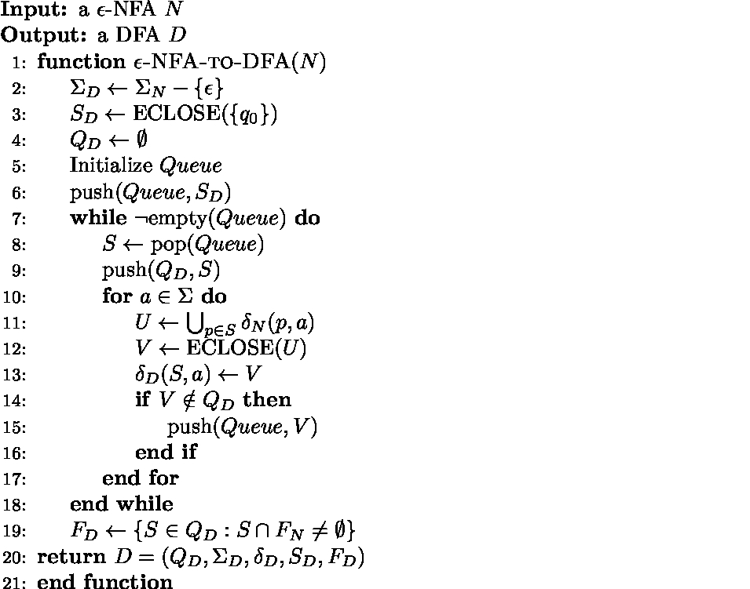
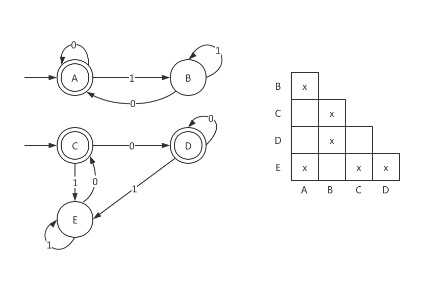

本篇文章关于DFA、NFA相关的算法。

<!--more-->

## DFA与NFA

### DFA

DFA的定义：

$$A = (Q, \Sigma, \delta, q_0, F)$$

其中
1. $Q$表示有限的状态的集合
2. $\Sigma$表示字符集
3. $\delta: Q\times \Sigma \rightarrow Q$表示状态转移函数
4. $q_0$是初始状态
5. $F$是接受状态集合

一个DFA A​接受的语言是​$L(A) = \lbrace w: \delta(q_0, w) \in F\rbrace$。

Julia Code:

```julia
struct DFA
    Q :: Set{Symbol}
    Σ :: Set{Symbol}
    δ :: Dict{Tuple{Symbol, Symbol}, Symbol}
    q0 :: Symbol
    F :: Set{Symbol}
end
```


### NFA

NFA的定义：

$$A = (Q, \Sigma, \delta, q_0, F)$$

和DFA不同的地方仅仅是状态转移函数$\delta$：

$$\delta(p, a) = \lbrace q_1, q_2, \ldots q_k\rbrace$$

其中$q_1, q_2, \ldots, q_k$都是一步有效的转移。


Julia Code:

```julia
struct NFA
    Q :: Set{Symbol}
    Σ :: Set{Symbol}
    δ :: Dict{Tuple{Symbol, Symbol}, Set{Symbol}}
    q0 :: Symbol
    F :: Set{Symbol}
end
```


### 拓展DFA与NFA

DFA与NFA的拓展定义：

1. 引入$\epsilon$转移：将$\epsilon$加入字符集$\Sigma$
2. 引入“死状态”：不必要求$\delta$是满的，$\delta$可以是偏函数，所有未定义的$\delta(p, a)$可以视作转移到“死状态”$\emptyset$，并且$\forall a, \delta(\emptyset, a) = \emptyset$。


## DFA、NFA和$\epsilon$-NFA的等价性与转换：

### DFA到NFA的转换

DFA是特殊的NFA，不需要转化。

### NFA到DFA的转换：子集构造法

NFA $A = (Q_A, \Sigma_A, \delta_A, S_A, F_A)$，构造DFA $D = (Q_D, \Sigma_D, \delta_D, S_D, F_D)$，使得$L(D) = L(A)$。

构造方法：

1. $Q_D = Q_A^\star = \lbrace S: S \subseteq Q_A \rbrace​$
2. $\Sigma_D = \Sigma_A$
3. $S_D = \lbrace S_A\rbrace$
4. $F_D = \lbrace S \subseteq Q_A : S\cap F_A \neq \emptyset \rbrace$ 
5. $\delta_D(S, a) = \bigcup_{p \in S} \delta_A(p, a)$

由于$Q_D$是$Q_A$的子集的集合，所及称作“子集构造法”，得到的DFA D的状态数是$O(2^n)$，其中$n = |Q_A|$。


但是实际上很多状态是**不可达**的，所以没必要真的考虑$Q_A^\star$中所有的元素，只需要从维护一个队列$Queue$，不断生成$\delta$转移表，将新出现的状态加入队列即可。

伪代码如下：


### $\epsilon$-NFA转DFA

关键在于消除$\epsilon​$转移，定义$\epsilon​$闭包：

$$\text{ECLOSE}(q) = \lbrace p: p \in \hat{\delta}(q, \epsilon) \rbrace​$$

显然$\text{ECLOSE}(q) $可以使用BFS快速求得。

拓展定义集合的$\epsilon$闭包：

$$\text{ECLOSE}(S) = \bigcup_{q\in S} \text{ECLOSE}(q)  $$


$\epsilon$-NFA转DFA和NFA转DFA十分相似，只是需要注意构造出的子集$S$求一次$\epsilon$闭包才是DFA的状态。

伪代码如下：




Julia Code:

```julia
function NFA_to_DFA(nfa :: NFA)
    Q = Set{Symbol}()
    Σ = setdiff(nfa.Σ, Set([:ϵ]))
    δ = Dict{Tuple{Symbol, Symbol}, Symbol}()
    q0 = set_to_Symbol(ϵ_close(nfa, nfa.q0))
    F = Set{Symbol}()

    queue = Vector{Set{Symbol}}()
    push!(queue, ϵ_close(nfa, nfa.q0))
    while !isempty(queue)
        S = popfirst!(queue)
        p = set_to_Symbol(S)

        push!(Q, p)
        !isempty(intersect(nfa.F, S)) && push!(F, p)

        for a in Σ
            tmp = Set{Symbol}()
            for p in S
                haskey(nfa.δ, (p, a)) && union!(tmp, nfa.δ[(p, a)])
            end
            T = ϵ_close(nfa, tmp)
            q = set_to_Symbol(T)
            δ[(p, a)] = q
            q ∉ Q && push!(queue, T)
        end
    end
    DFA(Q, Σ, δ, q0, F)
end
```


## 自动机的等价性和最小化

### 状态的等价性

定义：两个状态$p, q​$是等价的

$$p \Leftrightarrow q : \forall w \in \Sigma^\star, \hat{\delta}(p, w) \in F \Leftrightarrow \hat{\delta}(q, w) \in F​$$

如果$\exists w\in \Sigma^\star, \hat{\delta}(p, w) \in F, \hat{\delta}(q, w) \notin F​$，那么称$p,q​$是可区分的。


可以递归的判断两个状态是否可以区分：

1. $p \in F, q \notin F​$，那么$p, q​$可区分
2. 如果$r,s$可区分，并且$\exists a \in \Sigma, \delta(p,a)=r, \delta(q,a)=s$，那么$p,q$可区分

**填表算法**：不断的发现可区分对$(r,s)$，然后寻找新的可区分对$(p,q)$，直到表格不再增加新的可区分对。

> 为了加速填表算法，可以提前预处理出可以进入$(r,s)$对的$(p,q)$对：
>
> 枚举所有$(p,q)$对，将$(p,q)$加入$(\delta(p,a), \delta(q,a))$的列表中。


可以证明，填表算法能发现所有的可区分对，换言之，剩下的都是等价状态。填表算法的复杂度是$O(n^2)$。


Julia代码如下：

```julia
function get_Equivalent(dfa :: DFA)
    list = Dict((i,j)=>[] for i in dfa.Q, j in dfa.Q)
    for p in dfa.Q
        for q in dfa.Q
            for a in dfa.Σ
                (r, s) = (dfa.δ[(p, a)], dfa.δ[(q, a)])
                push!(list[(r, s)], (p, q))
            end
        end
    end

    equivalent = Dict((i,j)=>true for i in dfa.Q, j in dfa.Q)

    queue = []
    for p in dfa.F
        for q in dfa.Q
            if q ∉ dfa.F
                equivalent[(p, q)] = false
                push!(queue, (p, q))
            end
        end
    end
    while !isempty(queue)
        (r, s) = popfirst!(queue)
        for (p, q) in list[(r, s)]
            if equivalent[(p, q)]
                equivalent[(p, q)] = false
                push!(queue, (p, q))
            end
        end
    end

    equivalent
end
```


### 自动机的等价性

判断两个自动机等价的简单方法是将两个自动机放在一起视作一个大的自动机（虽然有两个初始状态，但没有影响）。然后执行填表算法，判断两个初始状态是否等价（不可区分）即可。

 


### 最小化DFA

定理：对于任意正则语言$L$，最小状态DFA是唯一的。


最小化DFA A的算法如下：

1. 排除所有不能从初始状态到达的状态；
2. 把剩下的状态划分为若干块，每一块内的状态都是等价的，且不同块的状态不等价，将这些块作为最小DFA的状态。


Julia代码：

```julia
function get_Minimum_DFA(dfa :: DFA)
    equivalent = get_Equivalent(dfa)

    Q :: Set{Symbol} = Set()
    vis = Dict(p=>false for p in dfa.Q)
    mapping = Dict(p=>Symbol() for p in dfa.Q)
    for p in dfa.Q
        if !vis[p]
            tmp = ""
            for q in dfa.Q
                if equivalent[(p, q)]
                    vis[q] = true
                    tmp *= String(q)
                end
            end
            s = Symbol(tmp)
            for q in dfa.Q
                if equivalent[(p, q)]
                    mapping[q] = s
                end
            end
            push!(Q, s)
        end
    end

    Σ = dfa.Σ
    δ = Dict((p,a)=>Symbol() for p in Q, a in Σ)
    for ((p,a), q) in dfa.δ
        δ[(mapping[p], a)] = mapping[q]
    end

    q0 = mapping[dfa.q0]
    F :: Set{Symbol} = Set()
    for p in dfa.F
        push!(F, mapping[p])
    end
    DFA(Q, Σ, δ, q0, F)
end
```

